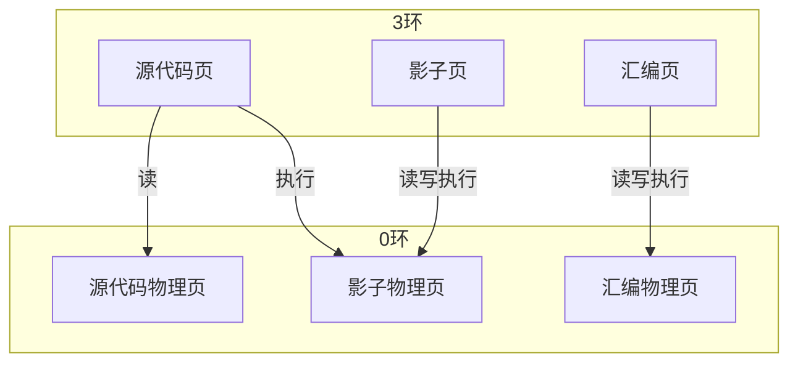

# hook流程图

```mermaid
flowchart TD
    subgraph R3["3环"]
        direction LR
        V1["源代码页"]
        V2["影子页"]
        V3["汇编页"]
    end

    subgraph R0["0环"]
        direction LR
        P1["源代码物理页"]
        P2["影子物理页"]
        P3["汇编物理页"]
    end

    V1 -->|"读"| P1
    V1 -->|"执行"| P2
    V2 -->|"读写执行"| P2
    V3 -->|"读写执行"| P3
```
