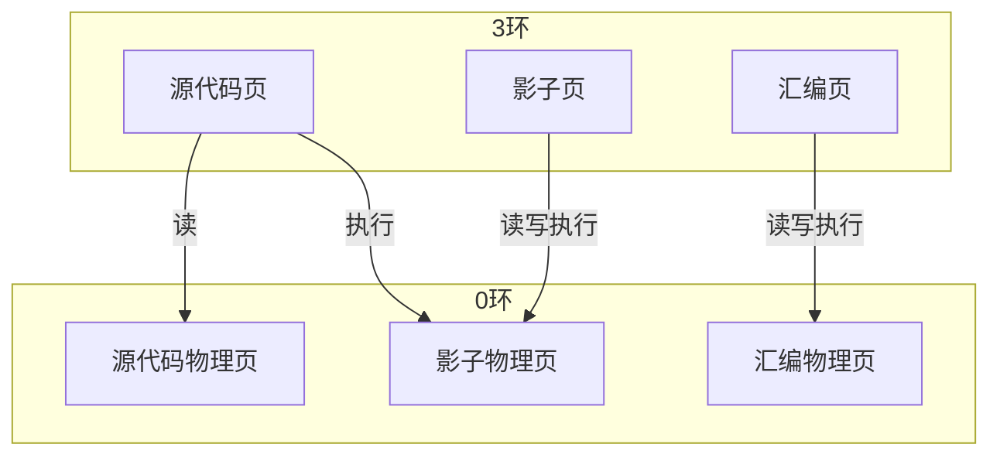

# hook流程图

```mermaid
flowchart TB
  subgraph ring3["3环"]
    direction LR
    src["源代码页"]
    shadow["影子页"]
    asm["汇编页"]
  end
  subgraph ring0["0环"]
    direction LR
    srcP["源代码物理页"]
    shadowP["影子物理页"]
    asmP["汇编物理页"]
  end
  src -->|读| srcP
  src -->|执行| shadowP
  shadow -->|读写执行| shadowP
  asm -->|读写执行| asmP
```